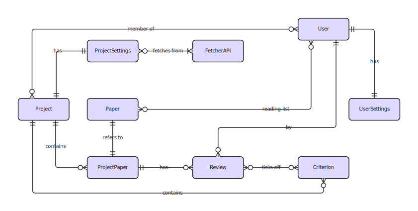

## System Architecture
The **SnowballIR** backend follows the modular and expandable Use Case Driven architecture. The division into clearly
separated layers enables high maintainability and simple testability. We also achieve clear data flows as a result. 
Communication between the frontend and backend takes place via gRPC, which ensures an efficient and strictly 
typed interface.

### [Frontend](https://github.com/SE-UUlm/snowballr-frontend)
- Built with [Svelte](https://svelte.dev/) and [TypeScript](https://www.typescriptlang.org/).
- Provides a graphical interface for user interactions.
- Sends and receives data via gRPC using generated stubs.

### [Backend](https://github.com/SE-UUlm/snowballr-backend)
- Built with [Kotlin](https://kotlinlang.org/) using gRPC.
- Provides application logic
- Handles data processing, and database access.
- Sends and receives calls defined in the API.

#### Facade layer
- The entry point for external requests
- Checks the requests for authentication, i.e. whether they originate from logged-in users 
- Checks the requests for validity, i.e. whether their content is valid, e.g. valid emails, values or text lengths, valid emails, value ranges or text lengths
- Interception of errors from the underlying layers in order to return semantically correct status codes
- All gRPC interfaces are provided here
  
#### Service layer
- Contains the business logic and orchestrates the application process
- Checks whether a user has the corresponding rights (authorization)

#### Repository layer
- Communication with the database
- Each service uses its own repositories to encapsulate access to entities such as users, projects or papers

### [API](https://github.com/SE-UUlm/snowballr-api)
- uses [gRPC](https://grpc.io/) for the communication between frontend and backend
- Protocol Buffers define the communication schema.
- Defines the calls implemented in the backend.

### Database
- [PostgreSQL](https://www.postgresql.org/) database stores all persistent data.
- Accessed only via the repository layer in the backend (for more information about the backend architecture see [backend architecture](https://github.com/SE-UUlm/snowballr-backend/blob/develop/wiki/Architecture.md))
- uses [Exposed](https://github.com/JetBrains/Exposed) DSL to build SQL statements

## Technologies Used

| Component | Technology                    |
|----------|-------------------------------|
| Frontend | React, TypeScript, Node.js    |
| Backend  | Kotlin, gRPC, Gradle          |
| API      | gRPC, Protocol Buffers        |
| Database | PostgreSQL, Exposed           |

---

# Database Schema

The following illustration shows a general ER-Diagram of the database structure used by the [backend](https://github.com/SE-UUlm/snowballr-backend). For 
more information about to access the database or a more detailed database have a look at the [repository layer](https://github.com/SE-UUlm/snowballr-backend/blob/develop/wiki/Contributing.md#repository) in the backend. 

