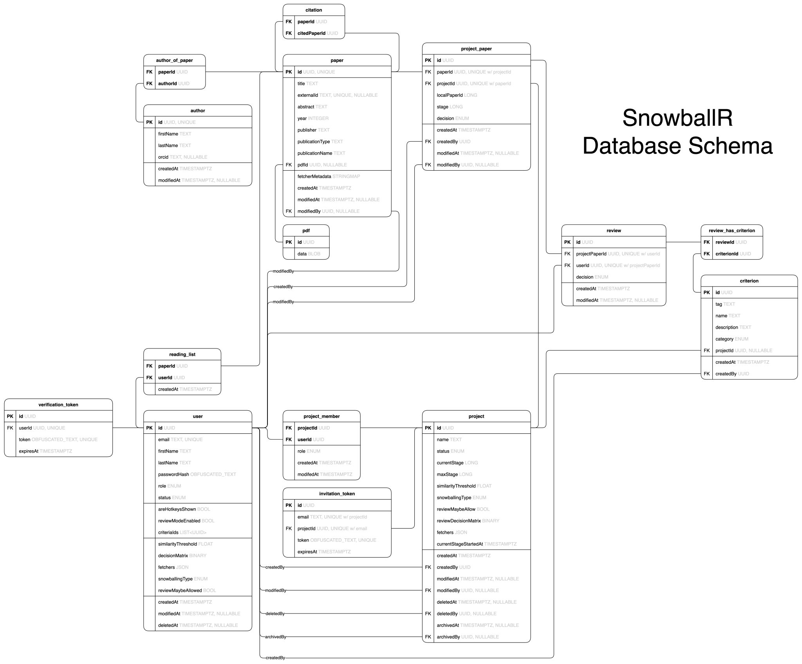

## System Architecture

The **SnowballR** backend follows the modular and expandable Use Case Driven architecture. The division into clearly
separated layers enables high maintainability and simple testability. We also achieve clear data flows as a result.
Communication between the frontend and backend takes place via gRPC, which ensures an efficient and strictly
typed interface.

### [Frontend](https://github.com/SE-UUlm/snowballr-frontend)

- Built with [Svelte](https://svelte.dev/) and [TypeScript](https://www.typescriptlang.org/).
- Provides a graphical interface for user interactions.
- Sends and receives data via gRPC using generated stubs.

### [Backend](https://github.com/SE-UUlm/snowballr-backend)

- Built with [Kotlin](https://kotlinlang.org/).
- Provides the application logic.
- Handles data processing and database access.
- Sends and receives data via gRPC using generated stubs.

#### Facade layer

- The entry point for external requests.
- Checks the requests for authentication, i.e., whether they originate from logged-in users.
- Checks the requests for validity, i.e., whether their content is valid, e.g., valid emails or text lengths.
- Interception of errors from the underlying layers to return semantically correct status codes.
- All gRPC interfaces are provided here.

#### Service layer

- Contains the business logic and orchestrates the application process.
- Checks whether a user has the corresponding rights (authorization).

#### Repository layer

- Communication with the database.
- Each service uses its own repositories to encapsulate access to entities such as users, projects or papers.

> **Note:** The architecture of the backend is described in more detail in the
> [backend wiki](https://github.com/SE-UUlm/snowballr-backend/wiki/Architecture).

### [API](https://github.com/SE-UUlm/snowballr-api)

- Uses [gRPC](https://grpc.io/) for the communication between frontend and backend.
- Protocol Buffers define the communication schema.

### Database

- [PostgreSQL](https://www.postgresql.org/) database stores all persistent data.
- Accessed only via the repository layer in the backend (for more information about the backend architecture see
  [backend architecture](https://github.com/SE-UUlm/snowballr-backend/wiki/Architecture)).
- Uses [Exposed](https://github.com/JetBrains/Exposed) as an ORM, i.e., use the Exposed DSL to build SQL statements.

## System and Technology Overview

The following diagram shows a general overview of the system and the technologies used in the **SnowballR** application.

User requests to the public endpoint [snowballr.informatik.uni-ulm.de](https://snowballr.informatik.uni-ulm.de/) are
routed through a _Caddy_ reverse proxy. Caddy manages the access to the internal services and handles TLS termination.

The **SnowballR** frontend is developed in _TypeScript_ using the _SvelteKit_ framework,
with _Vite_ as the build tool. The initial HTML page is served by the web server, after which the application is
rendered and executed client-side in the browser. Client-server communication is implemented via _gRPC_ (with Protocol
buffers), ensuring type-safe interactions for operations such as data retrieval and submission.

The backend is written in _Kotlin_ and does not rely on a higher-level server framework.
_Gradle_ is the build tool used in the backend. The backend encapsulates the application logic and interacts with
a _PostgreSQL_ database to persist user, project, paper, or other data.
As _gRPC_ is not natively compatible with browsers (see [here](https://github.com/grpc/grpc-web/discussions/1348) for
more details), so the _gRPC_ client of the user, an additional _gRPC-Web proxy_ is deployed between the browser and
the backend.

## Database Schema

The following illustration shows a general ER-Diagram of the database structure used by the backend.

The following illustration shows a more detailed version of the database schema:

