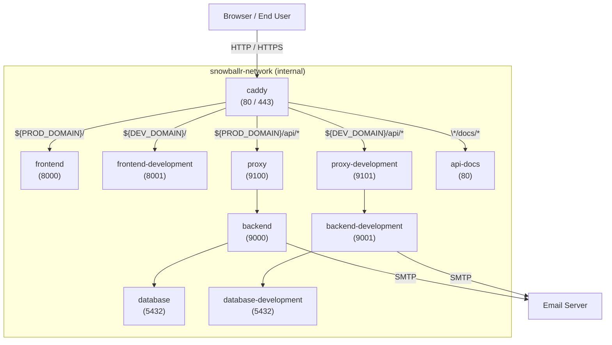

On this page, we explain how to contribute to the SnowballR project. We cover the following topics:

- [Contribution Workflow \& Conventions](#contribution-workflow--conventions)
  - [Workflow](#workflow)
  - [Commits \& Branches](#commits--branches)
- [Deployment](#deployment)
  - [Service Overview](#service-overview)
    - [Networks](#networks)
  - [Routing](#routing)
- [Versioning Guideline](#versioning-guideline)
  - [Release Procedure](#release-procedure)
- [Teamscale Integration](#teamscale-integration)

## Contribution Workflow & Conventions

### Workflow

Starting from an issue, we create a branch with the name of the issue (see [Commits & Branches](#commits--branches)).
It's up to you whether you create a draft pull request immediately or wait until you are finished with the
implementation. While creating a draft pull request gives you direct feedback from the CI/CD pipeline, it also clutters
the pull request list.

When starting to work on an issue, ensure that the issue is assigned to you and part of our project SnowballR.
Furthermore, make sure you set the status to `In progress` and the iteration to the current one (if that is not already
done). **Prefer** to work on issues that are already assigned to you and part of the current iteration/sprint.

When you are finished with the implementation, create a pull request (when not already done) and fill out the template.
If other branches were merged into `develop` while you were working on the issue, make sure to rebase your branch onto
the `develop` branch (`git rebase origin/develop`) and resolve any conflicts. Make sure that you don't rebase your
branch after you requested a review, as we experienced that the comments are hard to find afterward. Continue with
setting the status of the issue to `To review`. One other team member will then assign themselves as reviewer and set
the status to `In review`.

The reviewing process works as follows:

1. The reviewer will check the code and provide feedback. This can be done by adding comments to the pull request,
   preferably annotating the code directly. The reviewer can also approve the pull request if everything is fine.
2. If the reviewer requests changes, the author of the pull request (you) will either implement the changes or
   provide a reason why the changes are not necessary. In either case, the author should respond to all comments. The
   author should never resolve any comments themselves as this is the responsibility of the reviewer.
3. Once the reviewer is satisfied with the changes, they will approve the pull request. You can then merge the pull
   request into the `develop` branch. Make sure to use merge commits and not squash or rebase.
4. If there were updates to the `develop` branch while the pull request was in review, you will need to rebase your
   branch onto the `develop` branch again and resolve any conflicts. Make sure this is discussed with the reviewer.
5. After merging the pull request, the issue is automatically closed and the status is set to `Done`.

### Commits & Branches

For commits, we follow the [Conventional Commits](https://www.conventionalcommits.org/en/v1.0.0/) specification. The
commits are automatically checked by the [`Semantic PRs`](https://github.com/Ezard/semantic-prs) GitHub App when
creating a pull request.

A branch name should be `<prefix>/<issue-number>-<short-description>`, e.g. `fix/1234-fix-bug-in-component`. `prefix`
signals the type of the issue. For that we use the type of
[Conventional Commits](https://www.conventionalcommits.org/en/v1.0.0/) that best fits the issues. For instance, if the
issue is a bug, we use `fix/`, if it is a feature, we use `feat/`, etc. **Prefer** using the GitHub functionality to
create branches from an issue as it already provides `<issue-number>-<short-description>` and you only have to add the
`prefix/` part.

## Deployment

This project uses [Docker](https://www.docker.com/) for local and production deployments. All services are orchestrated
via [Docker Compose](https://docs.docker.com/compose/), with [Caddy](https://caddyserver.com/) serving as a reverse
proxy to route HTTP traffic to the appropriate services.

At the moment, we distinguish two deployments.

- **Production deployment** (`deploy-prod.yml`): The production version of the **SnowballR** application is deployed
whenever a new version of the application is released in this repository by creating a new tag.
The production version uses the latest version of the frontend, and the specific, tagged version of the backend.
- **Development deployment** (`deploy-dev.yml`): The deployment of the development version is performed nightly or
manually. It always uses the latest version of the frontend as well as backend.

The latest version of the frontend / backend is indicated by the `latest-dev` tag.

The deployment setup requires the following environment variables:

- `PROD_DOMAIN` — domain for the deployment of the production setup.
- `DEV_DOMAIN` — domain for the deployment of the development / testing setup.
- `WORK_DIR` — base working directory used for mounted volumes (e.g. where `database` volume is located).

### Service Overview

| Service                | Description / usage (short)                                 | Port       |
|------------------------|-------------------------------------------------------------|------------|
| `caddy`                | Public reverse-proxy & TLS certification                    | `80`,`443` |
| `frontend`             | Production Svelte GUI                                       | `8000`     |
| `frontend-development` | Development Svelte GUI (testing)                            | `8001`     |
| `api-docs`             | gRPC API documentation site                                 | `80`       |
| `proxy`                | Production gRPC proxy that forwards to backend              | `9100`     |
| `proxy-development`    | Development gRPC proxy that forwards to development backend | `9101`     |
| `backend`              | Production backend                                          | `9000`     |
| `backend-development`  | Development backend                                         | `9101`     |
| `database`             | PostgreSQL database for the production backend              | `5432`     |
| `database-development` | PostgreSQL database for the development backend             | `5432`     |

> **Note:** the _Port_ column lists only container ports, not host-published ports. Only `caddy` and `proxy` publish
> ports: `80`, `443`, `443/udp` or `9100` / `9101`, respectively.

The `backend` / `backend-development` service relies on the `database` / `database-development` service (PostgreSQL)
for permanent data storage. All database files are stored under `${WORK_DIR}/database` or
`${WORK_DIR}/database-development`, respectively.
The database services are not exposed publicly and cannot be accessed directly by external PostgreSQL clients.
The `*-development` services are used for development as they always use the latest version of the backend
and frontend and must not be stable and contain testing data.

#### Networks

- `snowballr-network` — Internal bridge network for communication between application services. All services are
  attached to this network, and this network cannot be accessed from outside the Docker environment.
- `snowballr-host` — Bridge network that provides access to the Docker host and external services.
  It is used by the `caddy` service to communicate with external clients and by the `backend` service to interact with
  the host’s email server.

### Routing

Caddy handles incoming HTTP(S) traffic and routes requests based on the configured domain and path.
Two domains are in use: one for the production deployment
([snowballr.informatik.uni-ulm.de](https://snowballr.informatik.uni-ulm.de/)),
which serves the end-user version of the application, and one for the development deployment
([snowballr-dev.informatik.uni-ulm.de](https://snowballr-dev.informatik.uni-ulm.de/)),
which is used to test new features (currently with the latest backend and the development profile).



## Versioning Guideline

For the versioning we follow [Semantic Versioning](https://semver.org/).
Whenever a new version of the application should be released, for example, due to new features, important bug fixes,
or general changes in the frontend or backend, a new release is created.

> **Note:** At the moment the [Frontend](https://github.com/SE-UUlm/snowballr-frontend) is not versioned.

### Release Procedure

A new release includes documenting all relevant changes in the _CHANGELOG.md_ and ensuring that the deployment
configuration in the _compose.yaml_ for the production backend references the desired backend version / tag.

When a new version of the **SnowballR** web application should be released, follow these steps:

1. Create a release branch for the release:

   ```bash
   git checkout -b releases/vX.Y.Z
   ```

   Replace `X`, `Y`, `Z` with the correct version numbers according to [Semantic Versioning](https://semver.org/).

2. Add an entry to the _CHANGELOG.md_. Prefer using [hallmark](https://github.com/vweevers/hallmark) to add the entry:

   ```bash
   hallmark cc add major|minor|patch
   ```

   Follow the guidelines of [Common Changelog](https://common-changelog.org/). Especially use imperative mood.

   > **Note**: To use hallmark install it globally with `npm install -g hallmark`

3. Commit and push changes to the _CHANGELOG.md_.

4. Make sure that the repository uses the
   [`Markdown Lint`](https://github.com/SE-UUlm/snowballr-ci/wiki/Getting-Started#markdown-lint) action and the
   [`Release`](https://github.com/SE-UUlm/snowballr-ci/wiki/Getting-Started#release) workflow from our CI repository to
   ensure a consistent changelog format and automatic release creation.

5. Update the tag of the _snowballr-backend_ image in the _compose.yaml_ to the new version.

6. Create a pull request and request a review.

7. After the pull request is merged, create a tag with the same version - so "vX.Y.Z" - at the merge commit.

   ```bash
   git pull main|develop
   git tag vX.Y.Z
   git push origin vX.Y.Z
   ```

Then the CI automatically creates a new release and deploys the new application version to the production server.

## Teamscale Integration

We use [Teamscale](https://teamscale.com/) for analyzing, monitoring and improving the quality of
our project. To set up the integration with your IDE follow the instructions online:

- [IntelliJ IDEA](https://docs.teamscale.com/howto/integrating-with-your-ide/intellij/)
- [VS Code](https://docs.teamscale.com/howto/integrating-with-your-ide/visual-studio-code/)

Note that the configuration file was already added, and you only have to connect the plugin to the server.
