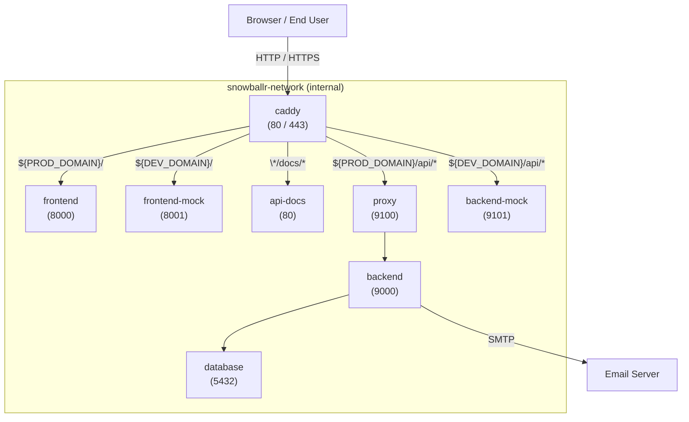

On this page, we explain how to contribute to the SnowballR project. We cover the following topics:

- [Contribution Workflow \& Conventions](#contribution-workflow--conventions)
  - [Workflow](#workflow)
  - [Commits \& Branches](#commits--branches)
- [Deployment](#deployment)
  - [Service Overview](#service-overview)
  - [Routing](#routing)
- [Versioning Guideline](#versioning-guideline)
- [Teamscale Integration](#teamscale-integration)

## Contribution Workflow & Conventions

### Workflow

Starting from an issue, we create a branch with the name of the issue (see [Commits & Branches](#commits--branches)).
It's up to you, whether you create a draft pull request immediately or wait until you are finished with the
implementation. While creating a draft pull request gives you direct feedback from the CI/CD pipeline, it also clutters
the pull request list. So it's up to you whether you want to create a draft pull request or not.

When starting to work on an issue, ensure that the issue is assigned to you and part of our project SnowballR.
Furthermore, make sure you set the status to `In progress` and the iteration to the current one (if that is not already
done). **Prefer** to work on issues that are already assigned to you and part of the current iteration/sprint.

When you are finished with the implementation, create a pull request (when not already done) and fill out the template.
If other branches were merged into `develop` while you were working on the issue, make sure to rebase your branch onto
the `develop` branch (`git rebase origin/develop`) and resolve any conflicts. Make sure that you don't rebase your
branch after you requested a review, as we experienced that the comments are hard to find afterward. Continue with
setting the status of the issue to `To review`. One other team member will then assign themselves as reviewer and set
the status to `In review`.

The reviewing process works as follows:

1. The reviewer will check the code and provide feedback. This can be done by adding comments to the pull request,
   preferably annotating the code directly. The reviewer can also approve the pull request if everything is fine.
2. If the reviewer requests changes, the author of the pull request (you) will either implement the changes or
   provide a reason why the changes are not necessary. In either case, the author should respond to all comments. The
   author should never resolve any comments themselves as this is the responsibility of the reviewer.
3. Once the reviewer is satisfied with the changes, they will approve the pull request. You can then merge the pull
   request into the `develop` branch. Make sure to use merge commits and not squash or rebase.
4. If there were updates to the `develop` branch while the pull request was in review, you will need to rebase your
   branch onto the `develop` branch again and resolve any conflicts. Make sure this is discussed with the reviewer.
5. After merging the pull request, the issue is automatically closed and the status is set to `Done`.

### Commits & Branches

For commits, we follow the [Conventional Commits](https://www.conventionalcommits.org/en/v1.0.0/) specification. The
commits are automatically checked by the [`Semantic PRs`](https://github.com/Ezard/semantic-prs) GitHub App when
creating a pull request.

A branch name should be `<prefix>/<issue-number>-<short-description>`, e.g. `fix/1234-fix-bug-in-component`. `prefix`
signals the type of the issue. For that we use the type of
[Conventional Commits](https://www.conventionalcommits.org/en/v1.0.0/) that best fits the issues. For instance, if the
issue is a bug, we use `fix/`, if it is a feature, we use `feat/`, etc. **Prefer** using the GitHub functionality to
create branches from an issue as it already provides `<issue-number>-<short-description>` and you only have to add the
`prefix/` part.

## Deployment

This project uses [Docker](https://www.docker.com/) for local and production deployments. All services are orchestrated
via [Docker Compose](https://docs.docker.com/compose/), with [Caddy](https://caddyserver.com/) serving as a reverse
proxy to route HTTP traffic to the appropriate services.

At the moment, deployments are performed nightly, always using the latest version of the API and the current state of
the `develop` branch of the [frontend](https://github.com/SE-UUlm/snowballr-frontend/tree/develop) and
[backend](https://github.com/SE-UUlm/snowballr-backend/tree/develop) /
[mock backend](https://github.com/SE-UUlm/snowballr-mock-backend/tree/main).
>**Note:** In the future, the versions should be pinned to and aligned with releases of the system parts to ensure
> stability and reproducibility.

The deployment setup requires the following environment variables:

- `PROD_DOMAIN` — domain for the deployment of the production setup.
- `DEV_DOMAIN` — domain for the deployment of the development / testing setup.
- `WORK_DIR` — base working directory used for mounted volumes (e.g. where `database` volume is located).

### Service overview

| Service         | Description / usage (short)                    |       Port |
|-----------------|------------------------------------------------|-----------:|
| `caddy`         | Public reverse-proxy & TLS certification       | `80`,`443` |
| `frontend`      | Production Svelte GUI                          |     `8000` |
| `frontend-mock` | Development Svelte GUI (testing)               |     `8001` |
| `api-docs`      | gRPC API documentation site                    |       `80` |
| `proxy`         | Production gRPC proxy that forwards to backend |     `9100` |
| `backend`       | Production backend                             |     `9000` |
| `backend-mock`  | Mock backend                                   |     `9101` |
| `database`      | PostgreSQL database                            |     `5432` |

> **Note:** the _Port_ column lists only container ports, not host-published ports. Only `caddy` and `proxy` publish
> ports: `80`, `443`, `443/udp` or `9100`, respectively.

The `backend-mock` service operates entirely in-memory and does not persist data.
In contrast, the `backend` service relies on the `database` service (PostgreSQL) for permanent data storage.
All database files are stored under `${WORK_DIR}/database`.
The `database` service is not exposed publicly and cannot be accessed directly by external PostgreSQL clients.

#### Networks

- `snowballr-network` — Internal bridge network for communication between application services. All services are
attached to this network and this network cannot be accessed from outside the Docker environment.
- `snowballr-host` — Bridge network that provides access to the Docker host and external services.
It is used by the `caddy` service to communicate with external clients and by the `backend` service to interact with
the host’s email server.

### Routing

Caddy handles incoming HTTP(S) traffic and routes requests based on the configured domain and path.
Two domains are in use: one for the production deployment
([snowballr.informatik.uni-ulm.de](https://snowballr.informatik.uni-ulm.de/)),
which serves the end-user version of the application, and one for the development deployment
([snowballr-dev.informatik.uni-ulm.de](https://snowballr-dev.informatik.uni-ulm.de/)),
which is used to test new features (currently with the mock backend).

## Versioning Guideline

For the versioning we follow [Semantic Versioning](https://semver.org/).
When a new version should be published, document the changes in a changelog (following the guidelines of
[Common Changelog](https://common-changelog.org/)), tag the code in Git and a release will be automatically created and
published.

>**Note:** At the moment only the [API](https://github.com/SE-UUlm/snowballr-api) is correctly versioned.

## Teamscale Integration

We use [Teamscale](https://teamscale.com/) for analyzing, monitoring and improving the quality of
our project. To set up the integration with your IDE follow the instructions online:

- [IntelliJ IDEA](https://docs.teamscale.com/howto/integrating-with-your-ide/intellij/)
- [VS Code](https://docs.teamscale.com/howto/integrating-with-your-ide/visual-studio-code/)

Note that the configuration file was already added, and you only have to connect the plugin to the server.
