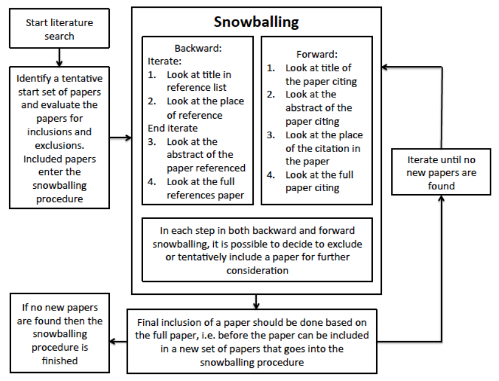

**SnowballR** is a Snowballing-SLR Web Application. Made to improve the process of creating and conducting SLRs.

#### SLR

A _Systematic Literature Review_ (SLR) is a structured and methodical procedure for identifying, evaluating and
synthesizing relevant research results or papers on a clearly defined research question. The aim is to obtain a
comprehensive overview of the current state of research, minimize bias and gain reliable findings.

#### Snowballing

_Snowballing_ is a complementary technique in which relevant literature is found by analyzing references
(backward snowballing) and citations (forward snowballing) of previously identified papers. This method enables a more
systematic identification of relevant literature that may have been overlooked in the initial search, and thus improves
the completeness of the literature search.

|  |
|:--------------------------------------------------:|
|            _Snowballing Procedure[^1]_             |

[^1]: [Claes Wohlin. "Guidelines for snowballing in systematic literature studies and a replication in software engineering"](https://dl.acm.org/doi/10.1145/2601248.2601268)

#### Requirements

- Create and manage collaborative SLR-projects
- Import papers from various sources
- Automated snowballing procedure
- Manual addition of papers
- Export of papers and SLR results
- User-defined filters and search functions
- Support during the review process
