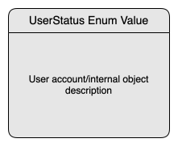

This page describes important processes within the **SnowballR** project.
The goal is to provide a clear overview of how interactions between users and the system are structured,
from account creation to project collaboration and internal processes.

Each process is documented either as a diagram, a step-by-step description, or a combination of both.
Where useful, additional clarifications are provided to highlight the involved components and their responsibilities.
This helps developers and contributors understand where functionality is implemented and how the different parts of the
system interact.

---

### User Account Lifecycle

The user account lifecycle diagram provides a high-level overview of the different stages a user account goes through
within the system. Each box represents a specific state of the account. At the top, the corresponding internal
`UserStatus` enum value is shown (if the user object exists). Below it, a short description outlines the
characteristics or conditions of that state.

The lifecycle is composed of six distinct states. The first three represent the primary phases of a user account, while
the remaining three correspond to the deletion and cleanup stages, which are initiated after an account has been
deleted and specific cron jobs have been triggered.

### Project Invitation Process

The project invitation process provides a high-level overview of the different stages a project invitation goes through
within the system. Each box represents a specific state of the invitation process.

In contrast to the user account lifecycle diagram, each state only contains a description since there are multiple
entities involved.

### Project Process

The project lifecycle diagram provides a high-level overview of the different stages a project can go through
within the system. Each box represents a specific state of the project lifecycle. At the top, the corresponding internal
`ProjectStatus` enum value is shown (if the project exists). Below it, a short description outlines the
characteristics of that state. Further information about the different statuses of a project can be found in the
[API documentation](https://snowballr.informatik.uni-ulm.de/docs/snowballr.html#enum-snowballr.ProjectStatus).

We distinguish between `ACTIVE` and `ACTIVE_LOCKED` projects to keep track of whether a project is freshly created and
is still configured or whether the SLR has already been started and the first papers fetched. In the latter case, the
project is locked to prevent certain changes to the settings, as, for example, changing configurations of the fetchers
that would influence the further process of the SLR.

### SLR Process

Integrating the diagrams described above provides a detailed overview of the main workflow: the systematic literature
review (SLR) process. Before initiating an SLR, a user must register an account and verify their email address.
After registration, this user can create a project and optionally invite collaborators, who are also required to have
verified accounts. Once the project is configured, the creator of the project — individually or with collaborators —
can begin the SLR.

The following diagram shows this main workflow in detail, assuming that the SLR is performed by a team of two
collaborators.

